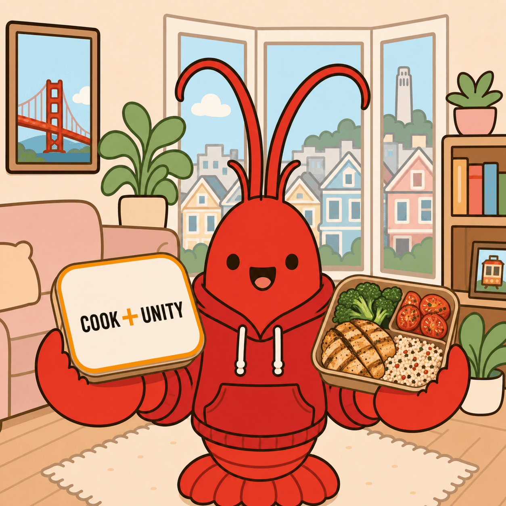

# CookUnity Meal Selector

<p align="center">
  
</p>

An [OpenClaw](https://openclaw.ai) skill that runs your weekly [CookUnity](https://www.cookunity.com)
order for you. Every Friday it logs in, picks meals you haven't eaten recently, confirms the
order, logs what it ordered to SQLite, and texts you the result.

## Quick install

Paste this into your OpenClaw agent and it will set the whole thing up:

```text
Install and configure the CookUnity Meal Selector skill from
https://github.com/dcc635/cookunity-meal-selector — do all of the following for me.

1. Install it:  openclaw skills install git:dcc635/cookunity-meal-selector
   Then run `openclaw skills info cookunity-meal-selector` and note the install path;
   everything below is relative to that directory.

2. Read the installed SKILL.md, README.md, and references/config.md so you understand
   how the skill works before configuring it.

3. Create the order-history database:
     sqlite3 ~/.openclaw/workspace/cookunity.db < <install path>/db/schema.sql
   Confirm with: sqlite3 ~/.openclaw/workspace/cookunity.db ".schema orders"
   If that database already exists, leave it alone and tell me.

4. Interview me, then fill in references/config.md. Ask about, one at a time:
     - how many meals I get per week and what mix (premium, new, breakfast, vegetarian)
     - what day my box is delivered, and whether the Friday run should order for the
       next delivery or the one after
     - where my CookUnity login lives: a 1Password item, or environment variables
     - which chat channel should notify me, and my chat id — offer to look it up with
       `openclaw directory self --channel telegram`
   Fill in every placeholder. Show me the finished file.

5. Offer to backfill my recent orders into the database from my CookUnity order emails
   or account history, so repeat-prevention works from week one instead of week seven.
   Include the menu section header verbatim in the `category` column. Skip if I decline.

6. Register the weekly cron job using references/install-cron.sh, with the variables at
   the top edited to match my config. Then show me the entry from `openclaw cron list`.

7. Tell me what you set up, and what is still left for me to do by hand.

Rules: never write my password into any file — credentials go in 1Password or the
Gateway environment only. Do NOT place a real CookUnity order during setup; this is
setup only. Ask me before overwriting anything that already exists.
```

It will stop and ask you for your credentials location, chat id, and meal preferences —
those can't be guessed. Nothing gets ordered until you ask for it.

Prefer to do it yourself? See [Install](#install) below for the manual steps.

---

You can also ask it to swap a single meal any time before the cutoff.

The interesting part is the **repeat prevention**: a local SQLite table of everything you've
ever been sent, so the picker can enforce "no regular meal within 6 weeks, no breakfast item
within 2 weeks," plus per-meal `avoid` and `snooze_until` flags for the ones you never want
again.

---

## Requirements

| | |
|---|---|
| [OpenClaw](https://docs.openclaw.ai) | a running Gateway (`openclaw gateway status`) |
| Browser tool | OpenClaw's built-in browser automation, with a persistent profile |
| `sqlite3` | `brew install sqlite` — usually already present on macOS |
| CookUnity account | with a subscription active enough to have an editable week |
| `op` (optional) | [1Password CLI](https://developer.1password.com/docs/cli/) if you store credentials there |

macOS and Linux. No CookUnity API is involved — this drives the real site, so it breaks when
CookUnity redesigns. See [When it breaks](#when-it-breaks).

---

## Install

The [Quick install](#quick-install) prompt above walks your agent through all six steps. Do it
by hand if you'd rather see each one.

### 1. Install the skill

Pick whichever route fits. All three land the skill in your active workspace's `skills/`
directory; add `--global` to install into the shared managed skills directory instead.

**From ClawHub** (once published — see [Publishing](#publishing-to-clawhub)):

```bash
openclaw skills install cookunity-meal-selector
```

**Straight from GitHub:**

```bash
openclaw skills install git:dcc635/cookunity-meal-selector
```

**From a local clone** — do this if you want to edit the meal-mix rules, which most people will:

```bash
git clone https://github.com/dcc635/cookunity-meal-selector.git
openclaw skills install ./cookunity-meal-selector
```

Confirm it registered:

```bash
openclaw skills list | grep cookunity
openclaw skills info cookunity-meal-selector
```

### 2. Create the database

The skill needs an `orders` table. The schema ships with the repo; the data does not — order
history is personal, so `*.db` is gitignored.

```bash
sqlite3 ~/.openclaw/workspace/cookunity.db < db/schema.sql
```

Verify:

```bash
sqlite3 ~/.openclaw/workspace/cookunity.db ".schema orders"
```

Starting from an empty table just means the first week or two has nothing to exclude. If you
want history from day one, backfill from your CookUnity order emails:

```sql
INSERT INTO orders (meal_name, order_date, meat_type, category)
VALUES ('Chicken Parmesan', '2026-07-12', 'Chicken', 'Meals | Protein & carb meals');
```

`category` must be the CookUnity menu section header, copied verbatim — the breakfast-vs-regular
repeat windows key off it. Rows with a `NULL` category are treated as regular meals.

### 3. Store your credentials

**1Password** (the default). Create an item named `CookUnity` in a vault named `OpenClaw`
with `username` and `password` fields, then check the skill can read it:

```bash
op item get 'CookUnity' --vault OpenClaw --fields username,password --reveal
```

For unattended cron runs the Gateway needs a service-account token in its environment
(`OP_SERVICE_ACCOUNT_TOKEN`) — an interactive `op` prompt will hang a cron job forever.

**Environment variables** instead: set `Source` to `env` in `references/config.md` and export
`COOKUNITY_USERNAME` / `COOKUNITY_PASSWORD` into the Gateway's environment.

Either way, credentials never go in this repo.

### 4. Configure

Open `references/config.md` in the installed skill and edit it. This is the only file you need
to touch — `SKILL.md` and `references/weekly-order.md` read every setting from it.

```bash
$EDITOR ~/.openclaw/workspace/skills/cookunity-meal-selector/references/config.md
```

At minimum, set:

- **Notifications → Target** — your chat id, from `openclaw directory self --channel telegram`.
  Set it to `none` to turn notifications off.
- **Meal Mix** — the shipped default is 7 meals: 3 premium with meat, 2 new/unrated with meat,
  1 top-rated breakfast, 1 vegetarian breakfast rated above 4.5. Yours is probably different.
- **Schedule → Which delivery** — the default `second` assumes a Friday run ordering for the
  Sunday *after* next, which is how CookUnity's cutoff worked when this was written. If your
  account's cutoff differs, use `next`.

Check the paths and browser profile while you're in there.

### 5. Schedule it

```bash
bash references/install-cron.sh
```

Edit the variables at the top of that script to match your config first. It wraps a single
`openclaw cron add` — Friday noon, 20-minute timeout, isolated session, with best-effort
fallback delivery so a crash before the final step still reaches you.

```bash
openclaw cron list          # next run time
openclaw cron runs <job-id> # history after it's fired
```

### 6. Try it

Ask your agent, in a chat:

> pick my CookUnity meals for next week

**This places a real order.** So does `openclaw cron run <job-id>`. The skill is written to
confirm aggressively rather than leave a half-edited cart, because an unconfirmed order means
no delivery. There is no dry-run mode. If you want to watch before trusting it, run it while
the browser window is visible.

To check the exclusion logic without ordering anything:

```bash
sqlite3 ~/.openclaw/workspace/cookunity.db \
  "SELECT meal_name, order_date, category FROM orders ORDER BY order_date DESC LIMIT 20;"
```

---

## Usage

Once installed, talk to it normally:

| Say | It does |
|-----|---------|
| "pick my CookUnity meals for next week" | the full weekly flow from `references/weekly-order.md` |
| "swap the salmon for the short rib" | removes one meal, adds another, re-confirms, updates the DB |
| "what did I order recently?" | queries the history table |
| "never suggest the chicken parm again" | sets `avoid = 1` |
| "snooze the meatloaf until September" | sets `snooze_until` |

Or by hand:

```sql
UPDATE orders SET avoid = 1 WHERE meal_name = 'Chicken Parmesan';
UPDATE orders SET snooze_until = '2026-09-01' WHERE meal_name = 'Meatloaf';
```

---

## Repo layout

```
SKILL.md                        the skill — swap flow, selection rules, pitfalls
references/config.md            ← the only file you edit
references/weekly-order.md      step-by-step runbook the cron job follows
references/install-cron.sh      registers the weekly job with openclaw cron
db/schema.sql                   orders table + indexes
```

`SKILL.md` sits at the repo root on purpose: `openclaw skills install git:owner/repo` and
ClawHub's GitHub importer both expect it there.

---

## When it breaks

This is browser automation against a site that changes without warning. Expect to fix it
occasionally.

- **Login fails** — CookUnity may have added a captcha or changed the login form. Check that
  the browser profile still has a valid session; log in manually once in that profile.
- **"Add meal" button missing** — you navigated to a product URL directly. That button only
  renders inside the SPA. Use the search flow. This and the other known traps are documented
  in the Common Pitfalls section of `SKILL.md`.
- **Order confirmed but nothing logged** — Step 7 failed after Step 6 succeeded. Insert the
  rows by hand, or next week's exclusions will be wrong.
- **Same meal suggested two weeks running** — almost always a missing `category` on the
  earlier row, so the breakfast window didn't apply.

Run history lives in `openclaw cron runs <job-id>`.

---

## Publishing to ClawHub

[ClawHub](https://clawhub.ai) is OpenClaw's skill marketplace — that's what `openclaw skills
install <slug>` and `openclaw skills search` talk to.

```bash
npm i -g clawhub
clawhub login          # GitHub OAuth; or: clawhub login --token clh_...
clawhub whoami
```

Preview, then publish:

```bash
clawhub skill publish . --dry-run
clawhub skill publish . \
  --slug cookunity-meal-selector \
  --name "CookUnity Meal Selector" \
  --changelog "Initial release"
```

New skills start at `1.0.0`; later publishes bump the patch version automatically unless you
pass `--version`. Alternatively, use the web GitHub importer at clawhub.ai — it only sees
`SKILL.md` at the root of **public, non-fork** repos owned by the signed-in account.

Two things to know before you publish:

- **Everything published to ClawHub is licensed `MIT-0`** — anyone may use, modify, and
  redistribute it, commercially, without attribution. That's why this repo ships an MIT-0
  `LICENSE`.
- **The bundle includes every file in the folder** (up to 50MB), honoring `.gitignore` and
  `.clawhubignore`. `*.db` is gitignored and `docs/` is clawhubignored, so neither your order
  history nor the 1.8MB mascot ends up in a ClawHub bundle. Note that `.clawhubignore` only
  applies to ClawHub publishes — `openclaw skills install git:...` is a plain clone and copies
  `docs/` too. Do re-read `references/config.md` before publishing a fork, since that file is
  *designed* to hold your chat id, vault names, and paths.

---

## License

[MIT-0](LICENSE).
